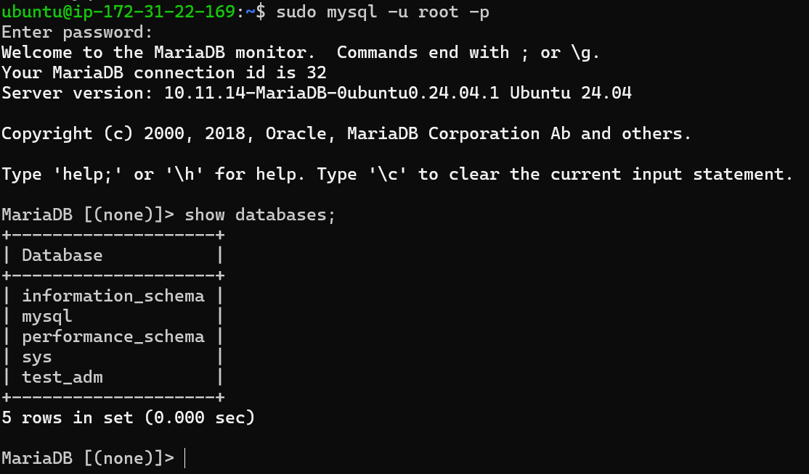
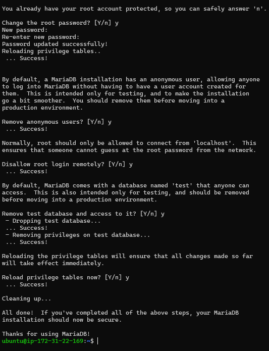
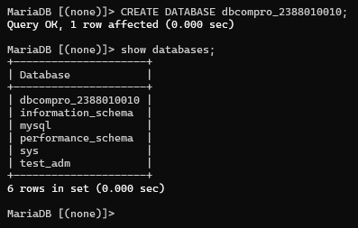

## Setting up databse di AWS Ec2 Menggunakana mariaDB
1. aktifkan instance AWS Ec2
2. remote via open ssh powershell / putty "ssh -i Nama_key.pem ubuntu@ip_address"
3. Patching OS (sudo apt-get update && sudo apt-get upgrade)
4. install maria DB "sudo apt install mariadb-server -y"
5. cek status mariaDB "systemctl status mariadb"

6. test default setting db server login dengan cara "sudo mysql -u root -p"

7. Hardening Database Server sudo mysql_secure_installation
    Change the password for the root user = Y
    Remove anonymous users = Y
    Disallow root login remotely = Y
    Remove test database and access to it = Y
    Reload privilege tables = Y

8. create db untuk website company profile
- "sudo apt systemctl restart mariadb"
- login sebagai root. masukan password yg sudah di bikin tadi
9. create database "CREATE DATABASE dbcompro_NIM;:

10. create user dengan nama : usrcompro_NIM dan password
- CREATE USER 'usrcompro_2388010010'@'localhost' IDENTIFIED BY '[PASSWORD]';

- Grant user akses ke DB yang baru dibuat => GRANT ALL PRIVILEGES ON dbcompro_2388010010.* TO 'usrcompro_2388010010'@'localhost';
- Flush privileges => FLUSH PRIVILEGES;
- exit;
- login sebagai usrcompro_NIM dan cek apakah bisa akses ke DB yang baru dibuat
