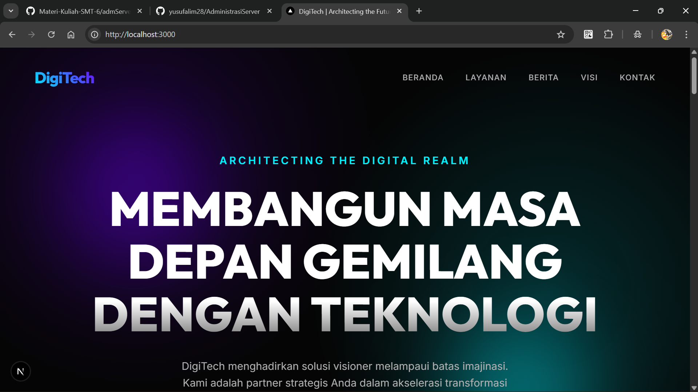
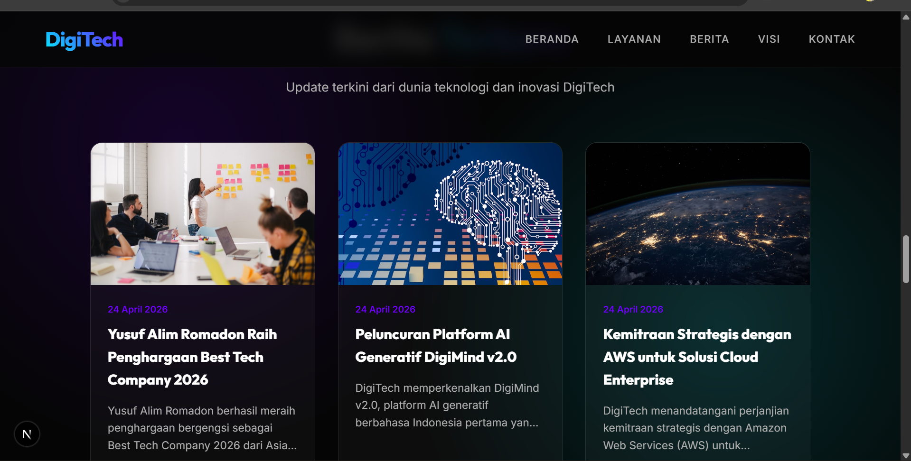

1. Pastikan Web Apps berjalan di local
- install dependensi 'npm install'
- jalankan web apps 'npm run dev'
- akses web apps di browser 'https://localhost:300'
2. 

Create static File -> npm run build
Archive folder standalone -> zip -> klik kanan folder standalone -> send to -> compressed (zipped) folder